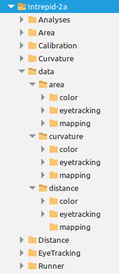

# Runner

This repository has the goal to provide a GUI interface to all the experimental tasks used for the Intrepid 2a project. It has no role in data analysis. The code also organizes the folder structure and downloads git repos if they do not exist in the expected location.

# Folder structure

There should be one project folder (e.g. "Intrepid2a"). This folder will have 1 subfolder each for all the repositories (which are capitalized), as well as a folder with data, called `data`. Data is sorted by experiment (`distance`. `area` and `curvature`) and within each of these there exist further subfolders for: 1) color calibration files (`color`), 2) blind spot mapping files (`mapping`) and 3) eye-tracking data (`eyetracking`).

# Utility functions

The file `utility.py` has a few utility functions. Two of these recreate the complete folder structure as illustrated above:

1. `pullGitRepos()`
2. `setupDataFolders()`

The first function `pullGitRepos()` by default only pulls updates from the remote origin if the folders already exist as local copies of the GitHub repositories. When first setting up the main project folder, you could set the argument `clone` to True to clone the GitHub repositories as well. By supplying a list of repository names in the `repos` argument, a subset of repositories can also be pulled or clones. 

The second function `setupDataFolders()` by default makes all folders that should exist and that will be used to collect data. By supplying a list of task names in the `tasks` argument, a subset of folders for specific tasks can also be created.

Planned utility functions 1) collect information on participants and which tasks they have done so far, 2) upload data to OSF.
